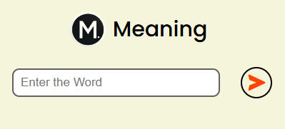
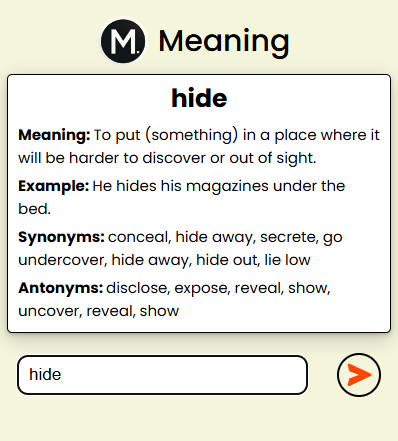

# 📖 Meaning - Chrome Dictionary Extension

**Meaning** is a simple and lightweight Chrome extension that helps you quickly find the **meaning**, **synonyms**, **antonyms**, and **examples** of any word. No need to open a new tab or search the web — just input the word, and get all the details instantly!

This is the first Chrome extension that I build.


## 🚀 Features

- 🔍 **Quick Definitions**: Find the meaning of any word in seconds.
- 📝 **Synonyms & Antonyms**: Enhance your vocabulary with alternative and opposite words.
- 💬 **Usage Examples**: Learn how to use the word in a sentence.
- 💻 **Simple UI**: Clean and intuitive interface for a seamless experience.
- ⚡ **Lightweight**: Minimal resource usage with fast performance.


## 📖 How to Use

Follow these steps to clone the repository and use the **Meaning** Chrome Extension:

1. **Clone the Repository**
   ```bash
   https://github.com/Shaw145/Meaning---A-Chrome-Extension.git
   ```

2. Navigate to the project directory:
   ```bash
   cd Meaning---A-Chrome-Extension
   ```

3. Load the Extension in Chrome
    - Open Chrome and navigate to chrome://extensions/.
    - Enable Developer mode (toggle in the top right corner).
    - Click on Load unpacked.
    - Select the folder where you cloned the repository.

4. Start Using the Extension
    - Click on the **Meaning** icon in your Chrome toolbar.
    - Enter the word you want to search in the input box.
    - Press **Enter** or click the search button.
    - Instantly view:
        - The **definition** of the word.
        - A list of **synonyms** and **antonyms**.
        - **Example sentences** for better understanding.


## 🖼️ Screenshots

<p style="display: flex; align-items: center; justify-content: space-evenly;">
  
  
</p>


## 🔧 Tech Stack

- **HTML5**: For the user interface.
- **CSS3**: For styling the extension.
- **JavaScript**: For the logic and functionality.
- **Chrome Extensions API**: To integrate with the browser.


## 🏗️ Future Enhancements

- 📚 Add support for multiple languages.
- 🔊 Include audio pronunciation.
- 📌 Save favorite words for quick reference.
- 🌐 Offline mode for finding meanings without an internet connection.


## 🤝 Acknowledgements

- Thanks to **[Dictionary API](https://dictionaryapi.dev/)** for providing the word data.
- Inspired by the love for words and learning!


Happy Learning! ✨
